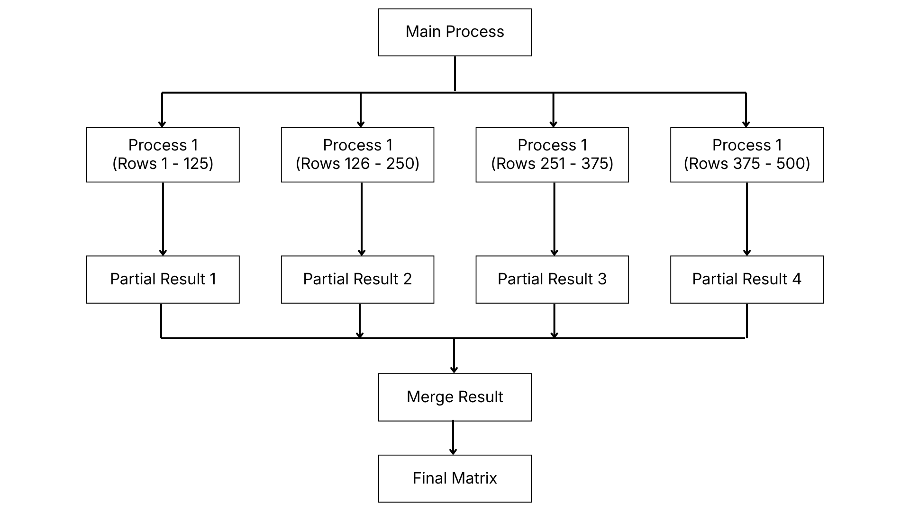

# System Architecture

[← Methodology](./methodology.md) | [Next → Implementation](./implementation.md)

---

The system consists of a main process and four worker processes.

The main process generates the matrices and distributes the workload to multiple worker processes.

Each worker process is responsible for calculating a subset of matrix rows. After all calculations are completed, the results are combined into the final matrix.

## Architecture Diagram

## Work Distribution

The matrix rows are divided equally among the available processes.

For example:

* Process 1 → Rows 1 – 125
* Process 2 → Rows 126 – 250
* Process 3 → Rows 251 – 375
* Process 4 → Rows 376 – 500

This workload distribution allows multiple CPU cores to work simultaneously and reduces overall execution time.
